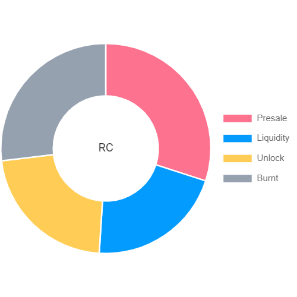

# Description of Supply for RC

## REWARD CYCLE Presale

Reward Cycle is the first token created by a doxed developer for our RC Elite holders. The original holders of a previous token increased it by 50x. The Reward Cycle token is primarily intended for all of our members and the RC Elite of the future. First token of our Reward Cycle will offer USDT. i think if we can take Hero Coin from 3k MC to 1.7MIllion MC in 7 days without any past experience, We can do same with Reward Token or better with all of your help.&#x20;

🌟WELCOME TO REWARD CYCLE

|                               |                                                                                                                                                                                          |
| ----------------------------- | ---------------------------------------------------------------------------------------------------------------------------------------------------------------------------------------- |
| Presale Address               | [0xc75b73ed4d3C25ccb7051f3Cc693C3f9ff0558c8](https://bscscan.com/address/0xc75b73ed4d3C25ccb7051f3Cc693C3f9ff0558c8)                                                                     |
| Token Address                 | 
<a href="https://bscscan.com/address/0x229a54Fb9De889C271380452C0483ce89b8C1e0D">0x229a54Fb9De889C271380452C0483ce89b8C1e0D</a> 

(Do not send BNB to the token address!)
 |
| Token Name                    | REWARD CYCLE                                                                                                                                                                             |
| Token Symbol                  | RC                                                                                                                                                                                       |
| Token Decimals                | 18                                                                                                                                                                                       |
| Total Supply                  | 1,000,000,000 RC                                                                                                                                                                         |
| Tokens For Presale            | 300,000,000 RC                                                                                                                                                                           |
| Tokens For Liquidity          | 210,000,000 RC                                                                                                                                                                           |
| Presale Rate                  | 1 BNB = 6,000,000 RC                                                                                                                                                                     |
| Listing Rate                  | 1 BNB = 6,000,000 RC                                                                                                                                                                     |
| Initial Market Cap (estimate) | $58,577                                                                                                                                                                                  |
| Soft Cap                      | 25 BNB                                                                                                                                                                                   |
| Hard Cap                      | 50 BNB                                                                                                                                                                                   |
| Unsold Tokens                 | Burn                                                                                                                                                                                     |
| Presale Start Time            | 2021.10.29 18:00 (UTC)                                                                                                                                                                   |
| Presale End Time              | 2021.10.31 18:00 (UTC)                                                                                                                                                                   |
| Listing On                    | [Pancakeswap](https://pancakeswap.finance/swap?outputCurrency=0x229a54Fb9De889C271380452C0483ce89b8C1e0D)                                                                                |
| Liquidity Percent             | 70%                                                                                                                                                                                      |
| Liquidity Lockup Time         | 365 days after pool ends                                                                                                                                                                 |

Token Metrics

Disclaimer: The information provided shall not in any way constitute a recommendation as to whether you should invest in any product discussed. We accept no liability for any loss occasioned to any person acting or refraining from action as a result of any material provided or published. © 2021 by Reward Cycle team!
